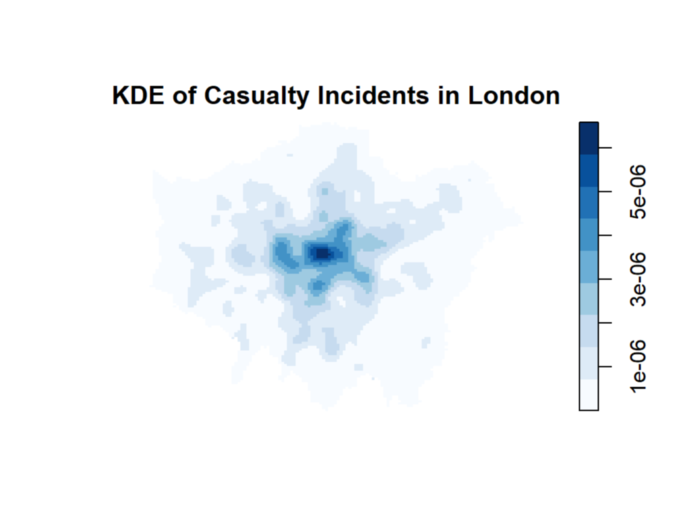
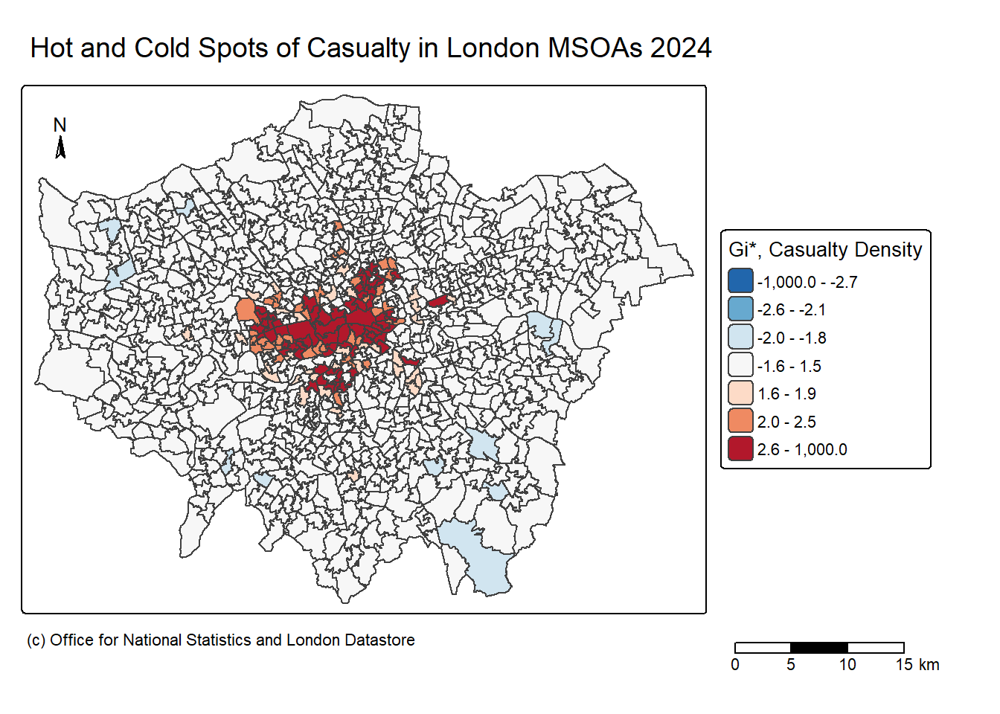
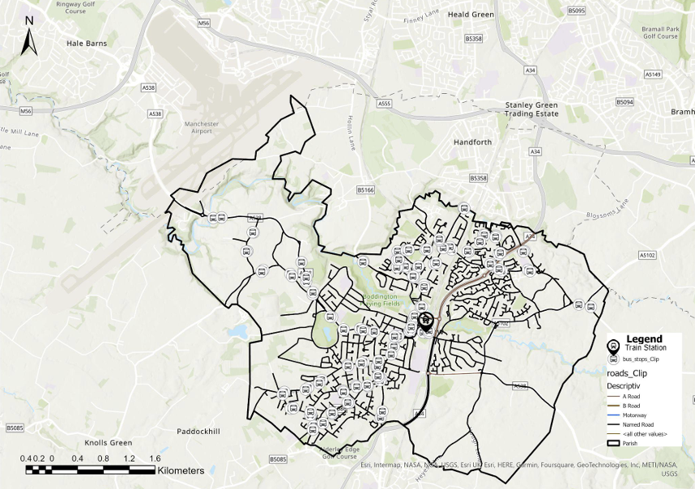
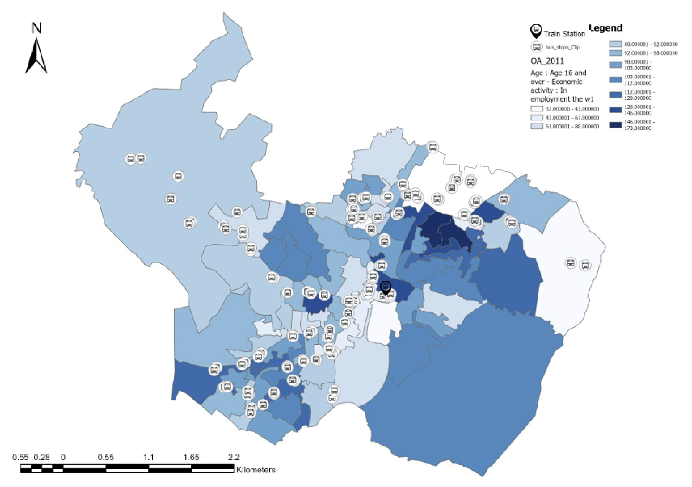
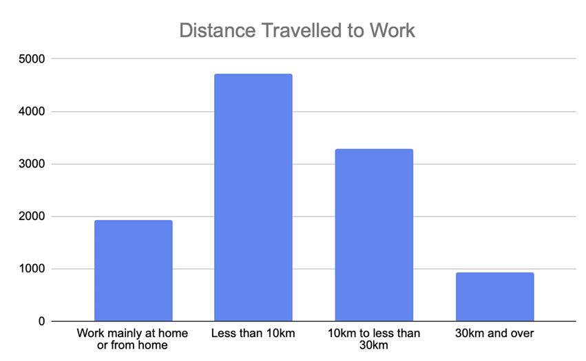

```{r setup, include=FALSE}
library(RefManageR)
BibOptions(check.entries = FALSE,
           bib.style = "authoryear",
           cite.style = "authoryear",
           style = "markdown",
           hyperlink = TRUE,
           dashed = FALSE,
           no.print.fields=c("doi", "url", "urldate", "issn"))
myBib <- ReadBib("../references.bib", check = FALSE)
```

```{r xaringan-themer, include=FALSE, warning=FALSE}
library(xaringanthemer)
library(xaringanExtra)

# Enable panelsets
xaringanExtra::use_panelset()

style_mono_light(
  base_color = "#2c3e50",
  background_color = "#fafafa",
  header_font_google = google_font("Libre Baskerville"),
  text_font_google   = google_font("Libre Baskerville"),
  code_font_google   = google_font("Fira Code"),
  base_font_size = "22px",
  header_h1_font_size = "2.2rem",
  header_h2_font_size = "1.8rem",
  header_h3_font_size = "1.4rem",
  # ALL custom CSS must live here together
  extra_css = list(
    ".title-slide h1" = list("font-size" = "40px", "margin-bottom" = "15px"),
    ".title-slide h2" = list("font-size" = "28px", "margin-top" = "0px", "margin-bottom" = "30px"),
    ".title-slide h3" = list("font-size" = "18px", "font-weight" = "normal", "margin-bottom" = "10px"),
    ".pull-left-narrow" = list("float" = "left", "width" = "30%"),
    ".pull-right-wide"  = list("float" = "right", "width" = "65%"),
    ".pull-left-wide"   = list("float" = "left", "width" = "65%"),
    ".pull-right-narrow" = list("float" = "right", "width" = "30%"),
    "a" = list("color" = "#fafafa", "text-decoration" = "underline"),
    "a:visited" = list("color" = "#fafafa"),
    ".tiny-text" = list("font-size" = "0.6em")
  )
)
```
# Outline
I have completed a diverse range of spatial and urban planning coursework during my bachelors and masters studies, this includes Wilmslow Baseline Analysis Report; Trafford Local Plan-Making - Transport, Development Management; Planning Application for Residential Development at Thornham Old Road, Oldham – Site Potential Evaluation and Design and Access Statement; Site Analysis and Local Character and Facilities with Map Making Illustrations; M3 1FB Context Analyses and Sustainable Development Final Project; M1 4HD Office Valuation Report, Housing Market Insights Report of Greater Manchester; Woodford Aerodrome, Stockport Public Local Planning Enquiry 

For this presentation I will focus specifically on my work related to transportation and mobility. 
- Spatial Analysis 
- Mobility vs Personality
- Transport Analysis and Policy Proposal
---
class: inverse, center, middle
# Spatial Analysis
<div style="display: inline-block; text-align: left;">
TfL Vision Zero Action Plan 
</div>
---
# TfL Vision Zero Action Plan

.panelset[
.panel[.panel-name[Background]
.small[
**Background and Policy Overview**
- **Goal**: Eliminate all deaths and serious injuries on London’s transport network by 2041.

- **Ambitions**: Focuses on safe speeds, safe streets, safe vehicles, and safe behavior.

- **Trends**: Fatality rates increased by 16% compared to 2023, with only a minor reduction in overall serious injuries.

- **Vulnerable Road Users**: Pedestrians, cyclists, and motorcyclists account for 80% of all fatalities.

- **Spatial Strategy**: Identifying high-risk hotspots is essential for targeted prevention and effective policy intervention.
]
]

.panel[.panel-name[Data]
.small[
**Which areas exhibit spatial hotspots clustering activity of deaths and serious injuries across London in 2024?** 

Hypothesis: Incidents causing deaths and injuries are not spatially random, and they do exhibit clustering in specific areas of London.
.pull-left-narrow[
Data: 
- London Boundaries Data (Polygon)
- London MSOA (Polygon)
- TfL Casualty Data (Point)]
.pull-right-wide[
Data Processing
- Spatial: Reproject CRS (EPSG:27700), subset MSOA boundaries to Greater London
- Filtering: Limit data to 2024 and filter "Fatal" and "Serious" data only
- Joins: Count casualties by MSOA and calculate density for hotspot analysis
]
]
]

.panel[.panel-name[Exploratory]
.small[Graphs and initial findings...
.pull-left[
```{r, echo=FALSE, out.width='100%', fig.align='center'}
# Picture: Histogram
knitr::include_graphics("../images/tfl_histogram.png")
```
<p style="font-size: 0.6em; text-align: center; margin-top: 0;">
Figure 1: Distribution of Casualty Events across London MSOA  
</p>
]
.pull-right[
```{r, echo=FALSE, out.width='100%', fig.align='center'}
# Picture: KDE

```
<p style="font-size: 0.6em; text-align: center; margin-top: 0;">
Figure 2: Distribution of Casualty Events across London MSOA  
</p>]
]
]

.panel[.panel-name[Spatial]
Hot and Cold Spot Analysis: Getis Ord Gi* and Moran's I
.pull-left-wide[
```{r, echo=FALSE, out.width='90%', fig.align='center'}
# Picture: Gitis Ord* Hotspot Map

```
<p style="font-size: 0.6em; text-align: left; margin-top: 0;">
Figure 3: Getis Ord Gi* Hotspot and Coldspot Map 
</p>
].pull-right-narrow[
### Moran's I
.center[
# 0.243
]
*p < 0.05* = significant spatial autocorrelation
<p style="font-size: 0.6em; text-align: left; margin-top: 0;">
(Casualty density is not randomly distributed, but spatially clustered) 
</p>
]]

.panel[.panel-name[Reflection]
### Limitations & Future Research
* **Temporal Scope**: Analysis is limited to 2024; longer time frame is required to capture long-term trends and patterns
* **Interpretation Warning**: Hotspots identify clustering of incidents, but they should not be viewed as the only "hazardous" areas for transport
* **Behavioral Factors**: High incident rates in Central London may be linked to urban stress; future research should incorporate **Big Five personality**
* **Land Factors**: Next steps include analyzing hotspots alongside **land use data** (commercial, residential, industrial) for holistic policy intervention.
]
]
---

class: inverse, center, middle
# Mobility vs Personality

---
# Mobility vs Personality
.panelset[
.panel[.panel-name[Existing Studies]
.pull-left[
```{r, echo=FALSE, out.width='100%', fig.align='center'}
# Picture: Big5 vs Migration Patterns
knitr::include_graphics("../images/big5_migration.png")
```
<p style="font-size: 0.6em; text-align: center; margin-top: 0;">
Figure 4: Causal Relationship Between Big5 and Migration Patterns (Dervied by Shuttleworth et al., 2021)
</p>
]
.pull-right[
```{r, echo=FALSE, out.width='100%', fig.align='center'}
# Picture: Big5 vs PESH
knitr::include_graphics("../images/big5_pesh.png")
```
<p style="font-size: 0.6em; text-align: center; margin-top: 0;">
Figure 5: Causal Relationships Between Regional Personality Differences and PESH Outcomes (Derived from Rentfrow et al., 2015)
</p>]
]

.panel[.panel-name[Proposed Research]
.pull-left-wide[
```{r, echo=FALSE, out.width='100%', fig.align='center'}
# Picture: Proposed RQ
knitr::include_graphics("../images/proposed_rq.png")
```
<p style="font-size: 0.6em; text-align: center; margin-top: 0;">
Figure 6: Causal Diagram for Proposed Research Question  
</p>]
.pull-right-narrow[
**How does ageing and one’s corresponding life experiences shape relationships between automobility and peri-urban “cheap sprawl**
]
]]
---
class: inverse, center, middle
# Transport Analysis and Policy Proposal 
---
# Baseline Analysis 1
.panelset[
.panel[.panel-name[Transport Network]
.pull-left-wide[
```{r, echo=FALSE, out.width='100%', fig.align='center'}
# Picture: Public Transport Infrastructure in Wilmslow

```
<p style="font-size: 0.6em; text-align: center; margin-top: 0;">
Figure 7: Public Transport Infrastructure in Wilmslow  
</p>
]
.pull-right-narrow[
- Bus
- Train
- Air 
]
]

.panel[.panel-name[Car Ownership]
.pull-left-wide[
```{r, echo=FALSE, out.width='100%', fig.align='center'}
# Picture: Car Ownership
knitr::include_graphics("../images/carownership.png")
```
<p style="font-size: 0.6em; text-align: center; margin-top: 0;">
Figure 8: Car Ownership and Households   
</p>
]
.pull-right-narrow[
.tiny-text[
- **High Ownership**: 40% own 2+ cars; 82% at least one car, above 73% national average
- **Commute Methods**: 92% drive to work; only 8% use public transport
- **Reasons to use**: Convenience, flexibility, and commuting to nearby cities
- **Spatial Patterns**: Ownership peaks in residential North/South areas; lower in the town center
]
]]

.panel[.panel-name[Commuting 1]
.pull-left[
```{r, echo=FALSE, out.width='100%', fig.align='center'}
# Picture: Train Bus Locations

```
<p style="font-size: 0.6em; text-align: center; margin-top: 0;">
Figure 9: Train and Bus Station Locations   
</p>
]
.pull-right[
```{r, echo=FALSE, out.width='100%', fig.align='center'}
# Picture: Travel to work by car or van
knitr::include_graphics("../images/carorvan_work.png")
```
<p style="font-size: 0.6em; text-align: center; margin-top: 0;">
Figure 10: Travel to work: Car or Vans   
</p>
]
]]
---
# Baseline Analysis 2
.panelset[
.panel[.panel-name[Commuting 2]
.pull-left[
```{r, echo=FALSE, out.width='100%', fig.align='center'}
# Picture: Travel to work distance

```
<p style="font-size: 0.6em; text-align: center; margin-top: 0;">
Figure 11: Distance of Travelling to Work
]
.pull-right[
```{r, echo=FALSE, out.width='100%', fig.align='center'}
# Picture: Travel Methods
knitr::include_graphics("../images/travel_methods.png")
```
<p style="font-size: 0.6em; text-align: center; margin-top: 0;">
Figure 12: Travel Methods in Wilmslow
]
]]

---
# Proposal
.panelset[
.panel[.panel-name[Active Travel]
- Improve pedestrian and cycling paths to encourage alternatives for short-distance travel
- "two-pronged" approach 
  - Promotes public health (physical and psychological) benefits while reducing car reliance
  - Improve environmental conditions
- Safety measures required (e.g. additional signs and potentially traffic directions to make sure users are within a safe margin)
]

.panel[.panel-name[Car Club]
- Establish short-term car rental services to reduce private car ownership and parking pressure
- A cost-effective "pay as you drive" model, that supports net-zero goals, improves air quality, and serves irregular household travel needs
- CoMoUK2021’s car club report: 27% of the respondents indicated that the reason for joining the car club membership is money saving and 75% of them agreed the fact that joining a car club membership can save money than owning a car
]

.panel[.panel-name[Public Transport Incentives]
- Introduce a monthly travel card subscription offering discounted fares and travel rewards (e.g. cash rebates)
- Increased demand can incentivise transport companies to improve bus frequencies, making public transport a more attractive and reliable commuting option
]
]
---
class: inverse, center, middle
# Thank You!
More can be found in: <a href="https://christychoicc.github.io/coursework.html" style="color: white;">Coursework Page</a>
